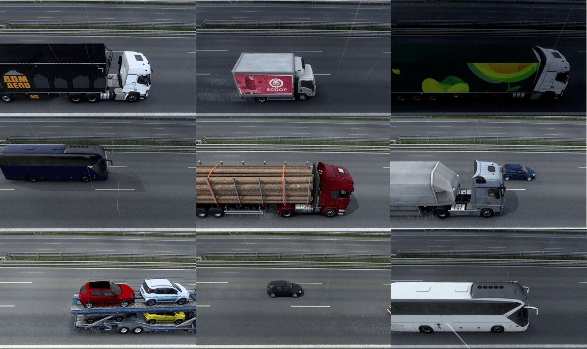

# axles_dataset
> Synthetic dataset - Detection of vehicle axles

This repository stores a synthetic dataset for detecting objects of the class vehicle wheels. The dataset is mostly composed of truck and bus vehicle images obtained in the Euro Truck Simulator 2 simulator.

The dataset is divided into training (3,061), testing (685) and validation (1,163).

## Distribution of Objects in the Synthetic Dataset

| Class       | Train  | Test  | Val       |
|:------------|:------:|:-----:|:---------:|
| bus         |    294 |    97 |       152 |
| car         |    475 |    90 |       265 |
| truck       |  2,749 |   569 |     1,161 |
| wheel       |  8,570 | 2,015 |     3,904 |

